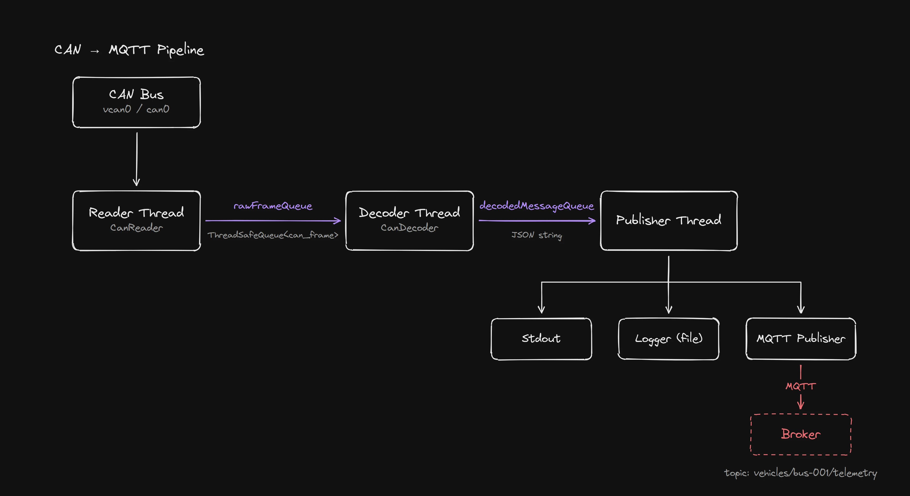

# Embedded Linux Vehicle Gateway

[](https://github.com/sarparslan/embedded-linux-vehicle-gateway/actions/workflows/ci.yml)
[](LICENSE)

A lightweight, multi-threaded telemetry gateway for electric vehicles, written in modern C++.
It reads raw CAN frames via **SocketCAN**, decodes them into physical signals, logs them, and
publishes them to an **MQTT** broker as JSON.



Reader, decoder, and publisher run on separate threads, connected by thread-safe queues.

## Decoded Signals

All multi-byte values are **little-endian**.

**Electric Motor — CAN ID `0x100`**

| Bytes | Signal             | Encoding                                |
|-------|--------------------|-----------------------------------------|
| 0–1   | `MotorRpm`         | uint16, rpm                             |
| 2–3   | `MotorCurrent`     | int16, × 0.1 A                          |
| 4     | `MotorTemperature` | uint8, value − 40 → °C                  |
| 5     | `MotorState`       | 0 Off, 1 Ready, 2 Running, 3 Fault      |
| 6     | `MotorDirection`   | 0 Neutral, 1 Forward, 2 Reverse         |

**BMS — CAN ID `0x200`**

| Bytes | Signal               | Encoding                                         |
|-------|----------------------|--------------------------------------------------|
| 0–1   | `BatteryVoltage`     | uint16, × 0.1 V                                  |
| 2–3   | `BatteryCurrent`     | int16, × 0.1 A (negative = discharge)            |
| 4     | `BatteryTemperature` | uint8, value − 40 → °C                           |
| 5     | `BatterySOC`         | uint8, %                                         |
| 6     | `BmsState`           | 0 Off, 1 Standby, 2 Discharge, 3 Charge, 4 Fault |
| 7     | flags                | bit0 ChargeAllowed, bit1 DischargeAllowed, bit2 ContactorClosed |

## Build

```bash
sudo apt install build-essential cmake libmosquitto-dev nlohmann-json3-dev can-utils mosquitto
cmake -S . -B build
cmake --build build
```

Settings live in `config/config.json` (CAN interface, MQTT host/port/topic, log file).
Pass a different file as the first argument: `./build/vehicle_gateway path/to/config.json`.

## Tests

Unit tests cover the CAN decoder, config loading, JSON serialization and the thread-safe queue.
They use GoogleTest, which CMake downloads automatically:

```bash
cmake -S . -B build -DVEHICLE_GATEWAY_BUILD_TESTS=ON
cmake --build build
ctest --test-dir build --output-on-failure
```

## Run

```bash
# 1. set up a virtual CAN interface (local testing)
sudo modprobe vcan
sudo ip link add dev vcan0 type vcan
sudo ip link set up vcan0

# 2. start the gateway from the repository root (Ctrl+C stops it cleanly)
./build/vehicle_gateway

# 3. follow the decoded telemetry (second terminal)
tail -f logs/telemetry.log

# 4. send test frames (third terminal)
cansend vcan0 100#DC05780064020100   # 1500 rpm, +12.0 A, 60 °C, Running, Forward
cansend vcan0 200#8C0F6AFF4B4E0206   # 398.0 V, -15.0 A, 35 °C, SOC 78 %, Discharge
```

Example output (also written to the log file and published over MQTT):

```json
{"signal":"MotorRpm","value":1500,"unit":"rpm"}
{"signal":"MotorState","value":"Running","unit":""}
{"signal":"BatteryVoltage","value":398,"unit":"V"}
{"signal":"BmsState","value":"Discharge","unit":""}
```

Subscribe to the telemetry topic:

```bash
mosquitto_sub -h localhost -t 'vehicles/bus-001/telemetry'
```

## Demo


